# PDT - part 2  

#### 1.     
Vyhľadajte v accounts screen_name s presnou hodnotou ‘realDonaldTrump’ a analyzujte
daný select. Akú metódu vám vybral plánovač a prečo - odôvodnite prečo sa rozhodol tak
ako sa rozhodol?

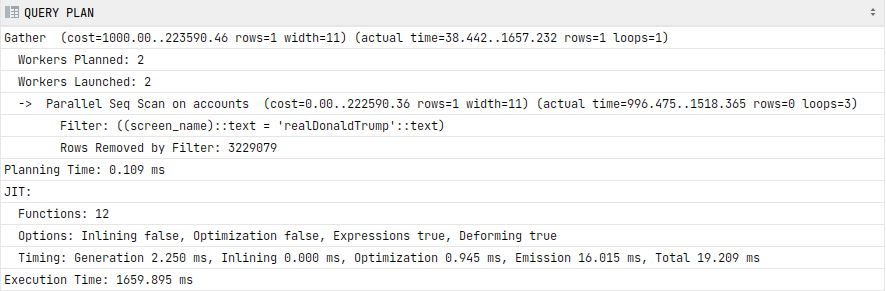

Vybral se paralel sequence scan. Neexistuje zatím žádný index a chceme match na jednu konkrétní hodnotu, Postgres musí tedy projít všechny hodnoty po jedné.

Paralel znamená, že na dané query pracovalo více "procesů". 

#### 2. 
Koľko workerov pracovalo na danom selecte a na čo slúžia? Zdvihnite počet workerov a
povedzte ako to ovplyvňuje čas. Je tam nejaký strop? Ak áno, prečo? Od čoho to závisí?

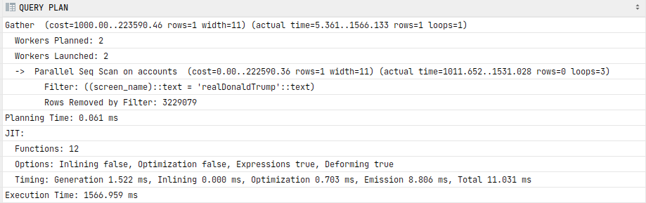

Na selektě pracovali defaultně 2 workry. Díky nim lze queries provádět paralelně. 

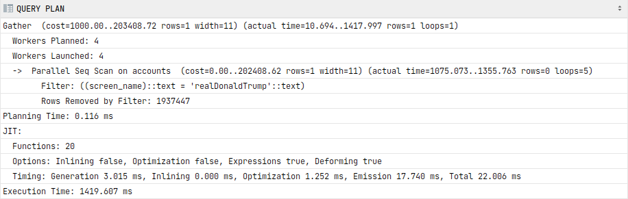

Při zdvihnutí počtu workerů se snížil čas. Velká úspora je při změně 0 workerů na 2 (o 31%). Při 4 workerech není úspora o moc větší. Oproti 0 workerů se čas snížil o 36%. S procesy je notně spjatá i další režije.

Maximální počet workerů na úlohu se mění pomocí *max_parallel_workers_per_gather*.
Strop je pak nastaven proměnnou *max_parallel_workers*.

#### 3. 
Vytvorte btree index nad screen_name a pozrite ako sa zmenil čas a porovnajte výstup
oproti požiadavke bez indexu. Potrebuje plánovač v tejto požiadavke viac workerov? Čo ovplyvnilo zásadnú zmenu času?

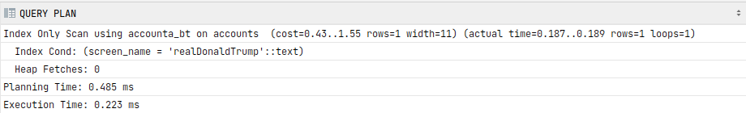

Čas se snížil 7439x oproti query v části 1. Nebylo potřeba procházet všechny záznamy. Existují už indexy v rámci btree, které se využily.

#### 4.
 Vyberte používateľov, ktorý majú followers_count väčší, rovný ako 100 a zároveň menší,
rovný 200. Je správanie rovnaké v prvej úlohe? Je správanie rovnaké ako v tretej úlohe?
Prečo?

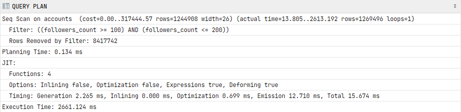

Chování je podobné první úloze. Tentokrát se ale jedná o sekvenční scan bez paralelismu.  Prošly se všechny řádky, které se vyfiltrovali.

Jinou možnost moc nemá, jelikož zatím není vytvořený index.

#### 5. 
Vytvorte index nad 4 úlohou a popíšte prácu s indexom. Čo je to Bitmap Index Scan a
prečo je tam Bitmap Heap Scan? Prečo je tam recheck condition?

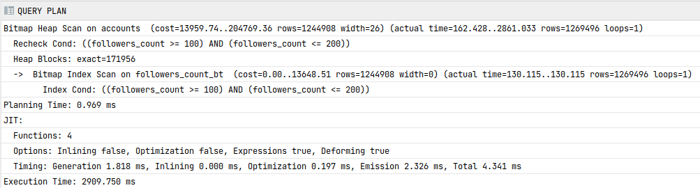

Nejřív se vytvoří Bitmap index pomocí projití tabulky scanem, přičemž bitmapy se vytváří na základě podmínky. Tyto bitmapy se sloučí pomocí AND. Každá bitmapa je k jedné stránce.  Nakonec se udělá scan po stránkách, přičemž podle bitmapy dané stránky se pozná, jestli má smysl ji navštívit. Ne všechny tuples ve stránce odpovídají podmínce. Musí být znovu zkontrolovány, proto recheck condition.

#### 6. 
Vyberte používateľov, ktorí majú followers_count väčší, rovný ako 100 a zároveň menší,
rovný 1000? V čom je rozdiel, prečo?

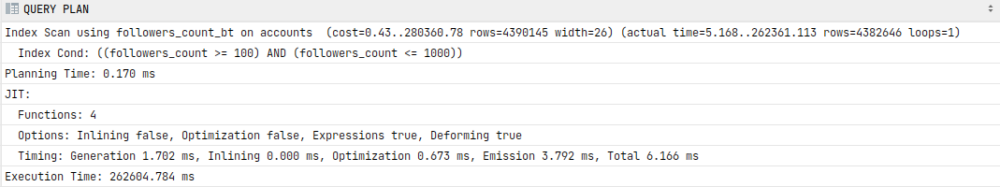

Počet výsledků je polovina ze všech hodnot. Bitmat index scan zdřejmě již neměl význam, tak se použil idex scan.

| Rozsah   |   Počet výsledků      |  Počet unikátních hodnot | 
|----------|:-------------:|------:|
|  <100, 200>  |1 269 496 |  101 |
|  <100, 10000> | 4 382 646   | 901 |
|  all |  8 786 922 | 83 576 |

####   7.
 Vytvorte daľšie 3 btree indexy na name, friends_count, a description a insertnite si svojho
používateľa (to je jedno aké dáta) do accounts. Koľko to trvalo? Dropnite indexy a spravte to
ešte raz. Prečo je tu rozdiel?

Bez indexů: 0.141 ms
S indexy: 308.905 ms

Indexy sice urychlují SELECT, ale při vkládání se musí počítat s dodatečnou režií. V případě btree se dost pravděpodobně budou rozdělovat, nebo jinak přeskládávat uzly, tak aby strom nedegradoval. 

Navíc se musí přepočítat více indexů.

#### 8. 

Vytvorte btree index nad tweetami pre retweet_count a pre content. Porovnajte ich dĺžku
vytvárania. Prečo je tu taký rozdiel? Čím je ovplyvnená dĺžka vytvárania indexu a prečo?

| Sloupec   |     Délka vytváření indexu      |  Počet unikátních hodnot | Velikost indexu
|----------|:-------------:|------:|------:|
| retwee_count  |26 s 602 ms  |  23880 |  214 MB 
| contend  |4 m 42 s 911 ms  |    14723540 |  3136 MB 

Je ovlivněna počtem unikátních hodnot. Čím větší, tím větší musí být i vytvořený strom a tím déle to trvá.

#### 9. 
Porovnajte indexy pre retweet_count, content, followers_count, screen_name,... v čom
sa líšia a prečo (opíšte výstupné hodnoty pre všetky indexy)?

a. create extension pageinspect;
b. select * from bt_metap('idx_content');

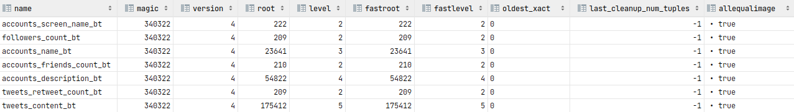

* magic: no idea
* version: verze btree
* root:  umístění kořene
* level: level kořene od spodu
* oldest_xact: TransactionId/xid field
* last_clean_up_number_tuples: ?? 
* allequalimage: ??

##### Fast root
Při delete se nikdy nemaže nejpravější stránka, nejde tedy snížit výšku stromu. Při velkých promazání může z toho důvodu být strom velmi úzký - o šířce např. 1 stránky, proto se drží záznam o nejnižším jednostránkovém levelu. Při vyhledávání se nemusí procházet od kořene dolů, ale začne se až na tomto nižším "kořeni".

V našem případě se žádné masivní delety nekonaly, proto root level a fastroot level jsou stejné. Největším indexem je tweets_content_bt, který také obsahuje nejvíce hodnot, proto má největší level. 

c. select type, live_items, dead_items, avg_item_size, page_size, free_size from
bt_page_stats('idx_content',1000);

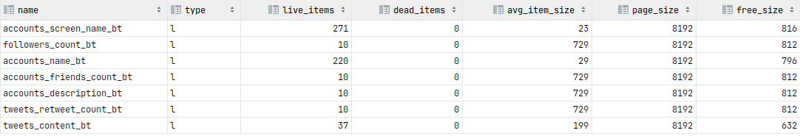

Dostáváme informace o single pages. Z předchozích informací je jasné, že jediná taková stránka je root. 

* type:
* live_items: použitelné položkx
* dead_items: ještě fyzicky neodstraněné položky, ale už vyřazené 
* avg_item_size: velikost 1 položky
* page_size: velikost stránky
* free_size: volné místo stránky

d. select * from bt_page_items('idx_content',1) limit 1000;

Infromace o položkách na každé stránce.

* itemoffset: pořadí položky
* ctid: zavedeno kvůli duplikátním key value, díky ctid zajištěno seřazení a uložení ve správném pořadí
* itemlen: délka položky
* nulls: ??
* htids: ??
* tids: ??

#### 10.
 Vyhľadajte v tweets.content meno „Gates“ na ľubovoľnom mieste a porovnajte výsledok
po tom, ako content naindexujete pomocou btree. V čom je rozdiel a prečo?

bez indexu: 469ms
s indexem: 547ms

Žádný signifikantní rozdíl není. Btree nám nemůže pomoct. Neznáme začátek contendu, není podle čeho porovnávat, můsí se tedy projet všechny řádky scanem. V tomto případě byl použit paralel seq scan.

#### 11. 
Vyhľadajte tweet, ktorý začína “The Cabel and Deep State”. Použil sa index?

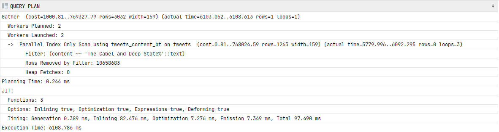

V mém případě ano. Dle stránky [pgdash](https://pgdash.io/blog/postgres-btree-index.html) se to ale běžně neděje.

#### 12. 
Teraz naindexujte content tak, aby sa použil btree index a zhodnoťte prečo sa pred tým
nad “The Cabel and Deep State” nepoužil. Použije sa teraz na „Gates“ na ľubovoľnom
mieste? Zdôvodnite použitie alebo nepoužitie indexu?

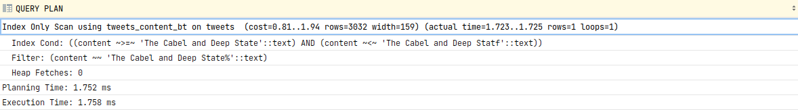

Použití btree indexu by se mělo umožnit až přidáním parametru  *text_pattern_ops*, který umožňuje indexovat přes text. Tímto spůsobem se to předpokládám muselo dělat v minulých verzích PostresSQL.

U '%Gates%' mi btree index napomůže. Tento string se nedá porovnávat.

#### 13. 
Vytvorte nový btree index, tak aby ste pomocou neho vedeli vyhľadať tweet, ktorý konči
reťazcom „idiot #QAnon“ kde nezáleží na tom ako to napíšete. Popíšte čo jednotlivé funkcie
robia.

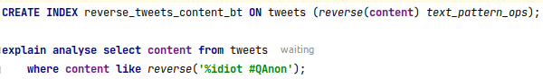

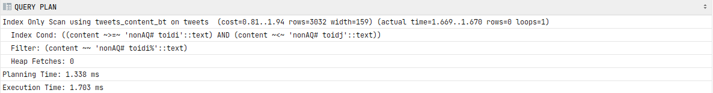

1. Vytvořím reverse btree index, který seřazuje odkonce.
2. Můžu vyhledávat stringy podle konce, pokud je před porovnáním také reversnu.

#### 14. 
Nájdite účty, ktoré majú follower_count menší ako 10 a friends_count väčší ako 1000 a
výsledok zoraďte podľa statuses_count. Následne spravte jednoduché indexy a popíšte
ktoré má a ktoré nemá zmysel robiť a prečo.

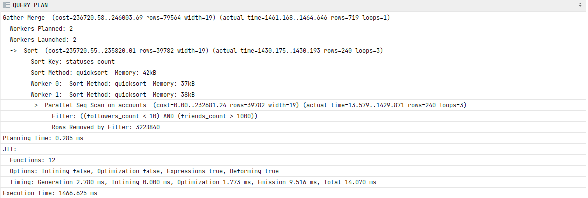

Na podmínku se použil paralel scan. Na seřazení quicksort, který se vlezl do paměti (42kb).

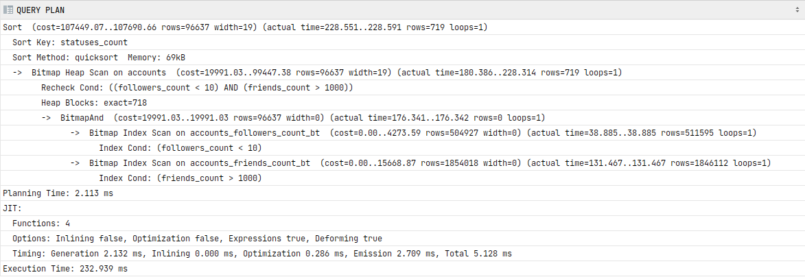

**Podmínka**:
Nad *followers_count* a *friends_count* se automaticky vytvořily bitmap indexy nad btree. Oba indexy se použily při scanu vybraných stránek.

**Seřazení**:
I po přidání btree se stále používá quicksort, protože je to výhodnější jak tvořit hashe.

#### 15. 
Na predošlú query spravte zložený index a porovnajte výsledok s tým, keď je sú indexy
separátne. Výsledok zdôvodnite.

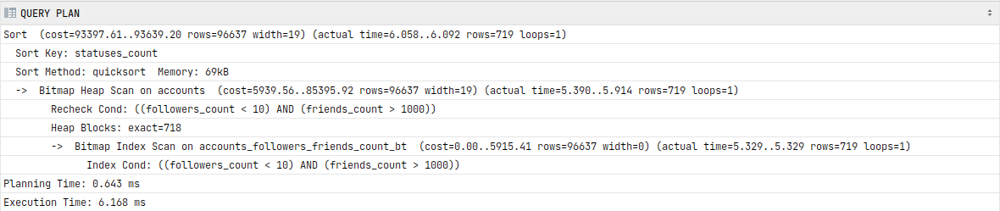

Tady se použil složený index na scanování stránky, o to je výsledek rychlejší.

#### 16. 
Upravte query tak, aby bol follower_count menší ako 1000 a friends_count väčší ako
1000. V čom je rozdiel a prečo?

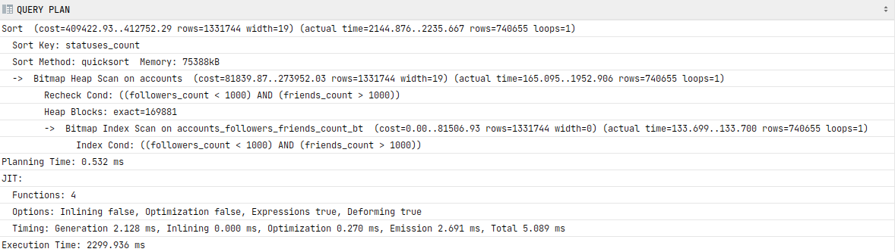

Je tu mnohem víc heap_blocks. Musí se procházet více stránek, je to pomalejší.

#### 17. 
Vytvorte vhodný index pre vyhľadávanie písmen bez kontextu nad screen_name v
accounts. Porovnajte výsledok pre vyhľadanie presne ‘realDonaldTrump’ voči btree indexu?
Ktorý index sa vybral a prečo? Následne vyhľadajte v texte screen_name ‘ldonaldt‘ a
porovnajte výsledky. Aký index sa vybral a prečo?

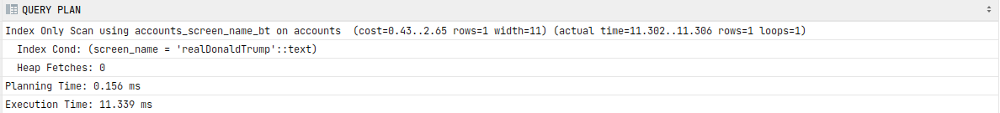

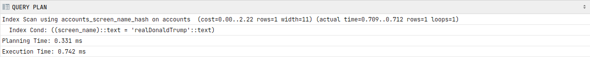

Chceme přesnou shodu. Hash index je rychlejší, jeslikož má časovou složitost O(1). Pokud necháme oba indexy, vybere se rychlejší hash.

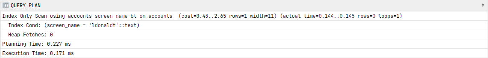

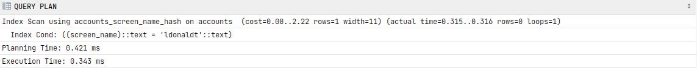

U hash indexu je čas ještě nižší, jelikož nemusel nikam přistupovat, když zjistil, že *screen_name* neexistuje. 

U btree je také čas nižší o přístup k datům.

#### 18. 
Vytvorte query pre slová "John" a "Oliver" pomocou FTS (tsvector a tsquery) v angličtine
v stĺpcoch tweets.content, accounts.decription a accounts.name, kde slová sa môžu
nachádzať v prvom, druhom ALEBO treťom stĺpci. Teda vyhovujúci záznam je ak aspoň jeden
stĺpec má „match“. Výsledky zoraďte podľa retweet_count zostupne. Pre túto query
vytvorte vhodné indexy tak, aby sa nepoužil ani raz sekvenčný scan (správna query dobehne
rádovo v milisekundách, max sekundách na super starých PC). Zdôvodnite čo je problém s
OR podmienkou a prečo AND je v poriadku pri joine.

1. Vytvoření pomocných sloupců ts_vector

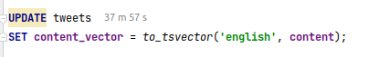
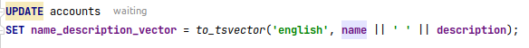  

2. Vytvoření indexu
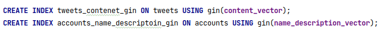  

3. Vytvoření query
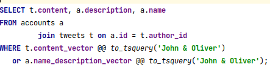  

Více doladit query jsem nestla kvůli délce vytváření indexů a vektorů. 
 