# PDT - part 3

#### 1. 
stiahnite a importujte si dataset pre Open Street mapy z
http://download.freemap.sk/slovakia.osm/slovakia.osm.pbf do novej DB

done

#### 2. 
zistite aké kraje sú na Slovensku (planet_osm_polygon, admin_level = ‘4’) a vypíšte
ich súradnice ako text s longitude a latitude.

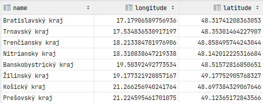

#### 3. 
zoraďte kraje podľa ich veľkosti (st_area). Veľkosť vypočítajte pomocou vhodnej
funkcie a zobrazte v km^2 v SRID 4326.

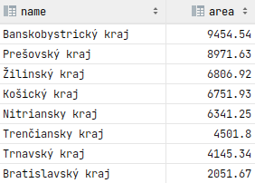

#### 4. 
pridajte si dom, kde bývate ako polygón (nájdite si súradnice napr. cez google maps)
do planet_osm_polygon (znova pozor na súradnicový systém). Výsledok zobrazte na
mape.

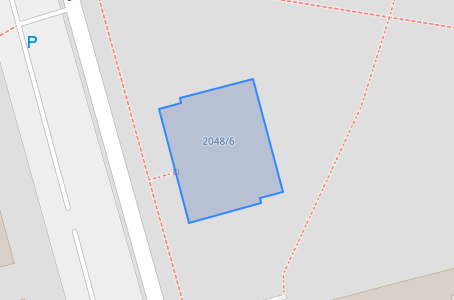

#### 5. 
zistite v akom kraji je váš dom.

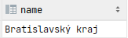

#### 6. 
pridajte si do planet_osm_point vašu aktuálnu polohu (pozor na súradnicový
systém). Výsledok zobrazte na mape.

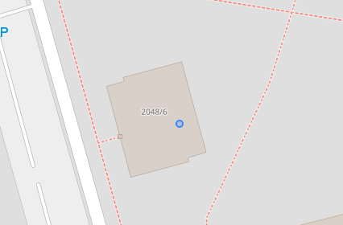

#### 7. 
zistite či ste doma - či je vaša poloha v rámci vášho bývania.

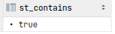

#### 8. 
zistite ako ďaleko sa nachádzate od FIIT (name = 'Fakulta informatiky a informačných
technológií STU'). Pozor na správny súradnicový systém – vzdialenosť musí byť
skutočná.

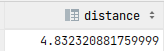

4.83 km

#### 9. 
Stiahnite si QGIS a vyplotujte kraje a váš dom z úlohy 2 na mape - napr. červenou
čiarou.

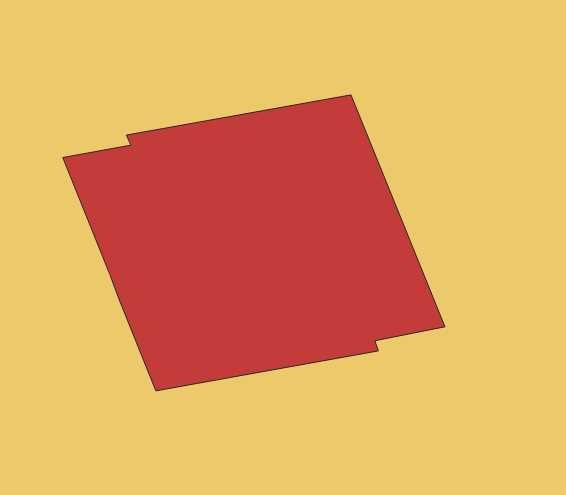

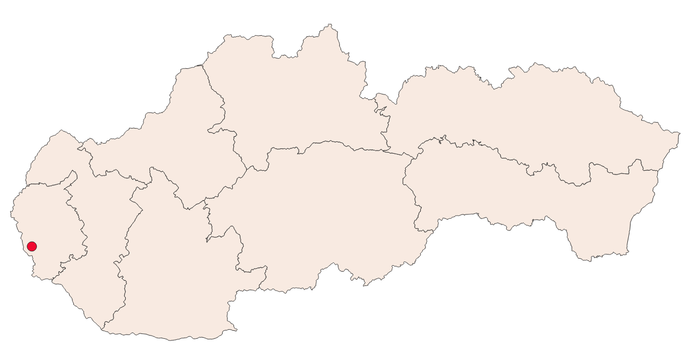

#### 10. 
Zistite súradnice centroidu (ťažiska) plošne najmenšieho okresu (vo výsledku
nezabudnite uviesť aj EPSG kód súradnicového systému).

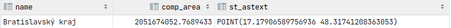

ESPG = 4326

#### 11. 
Vytvorte priestorovú tabuľku všetkých úsekov ciest, ktorých vzdialenosť od
vzájomnej hranice okresov Malacky a Pezinok je menšia ako 10 km.

#### 12. 
Jedným dopytom zistite číslo a názov katastrálneho územia (z dát ZBGIS,
https://www.geoportal.sk/sk/zbgis_smd/na-stiahnutie/), v ktorom sa nachádza
najdlhší úsek cesty (z dát OSM) v okrese, v ktorom bývate.

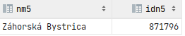

#### 13. 
Vytvorte oblasť Okolie_Bratislavy, ktorá bude zahŕňať zónu do 20 km od Bratislavy,
ale nebude zahŕňať oblasť Bratislavy (Bratislava I až Bratislava V) a bude len na území
Slovenska. Zistite jej výmeru.

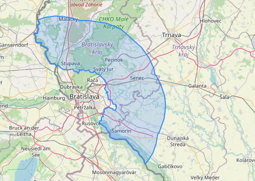