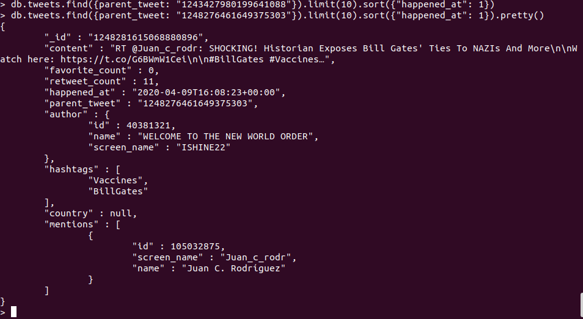

# PDT - part 4

### 1. Návrh
#### Rozdělení vztahů:    

**One-to-One**  
spojit

**One-to-Few**   
embedding (spojit)   
např. adressy  

**One-to-Many**  
stovky, max tisíce  
reference pomocí ObjectID  
nebo pole referencí  

**One-to-Squillions**  
přes 16 MB (max velikost dokumentu)  
16 MB / sizeof(id) = 16 MB / sizeof(varchar(20)) = 800 000  
forein key  

#### Vztahy v databázi tweets:

| Vztah  | Max extreme  | Avg exteme  | Max all  | Avg all  |
|---|---|---|---|---|
|  Hashtags | 31  | 3,68  | 47  |  2,39 |
| Retweets  | 175  |  3,09 | 70 000  | 4,69  |
|  Mentions | 49  | 0,012  |   |   |
|  Accounts | 6  | 0,014  | 14 190 | 2,17 |
|  Countries | 1  | &lt; 1  | 1| &lt; 1 |

**Hashtags**  
Hashtagy přidávají uživatelé při vzniku tweetu. Nepředpokládám, že by jich tam někdo vyklikal tisíce. Jedná se ovztah One-to-Few a všechny hashtagy budou v poly v tweets.

**Retweets**  
Maximální počet extrémních retweetů je 175, všech v databázi už 70 000, což nepříjemně atakuje hranici 80 000.  Dle druhé query máme najít retweety tweetu s id. Nejpřiléhavější je tedy vztah One-to-Squillions.

**Mentions**  
Tweets má omezenou délku, proto i počet mentions je omezený. Maximální počet mentions ve všech tweetech je 49. Stačí tedy vztah One-to-Few.

**Accounts**  
Maximální počet tweetů poblikovaných jedním účtem je u extrémních tweetů malý (6), u všech v databázi už je to 14 190. 

U účtů je možnost měnit si *user_name* a *screen_name*. Proto by Account by měl být samostatná collection.

Druhá z předepsaných query bude vypisovat tweety se základními informacemi o uživately. Pokud informace zduplikujeme do tweets, nemusíme dělat joiny, nebo 2 samostatné dotazy.

Naknec se jedná o vztah One-to-Squillions se sduplikováním informací.

**Countries**   
Každý tweet má jednu, nebo žádnou zemi. Vložíme ji tedy přímo do tweetu - One-to-One.


#### Výsledné schéma:  
**Tweets**  
```json
{
	"_id" : "1232257093316550657",
	"content" : "Personally, I don't buy into the Corona Virus being a natural event. It's more likely to have been executed by the NWO to move agenda 2030 forward. Here's a short song I released BEFORE the outbreak - https://t.co/8F3GRJBy3e\n #agenda21 #agenda2030 #georgiaguidestones  Plz Share",
	"favorite_count" : 18,
	"retweet_count" : 7,
	"happened_at" : "2020-02-25T10:52:39+00:00",
	"parent_tweet" : null,
	"author" : {
		"id": "65498724376987"
		"name" : "Martin Noakes",
		"screen_name" : "Marndin12"
	},
	"hashtags" : [
		"georgiaguidestones",
		"agenda2030",
		"agenda21"
	],
	"country" : null,
	"mentions" : null
}

```

**Account**  
```json
{
	"_id" : ObjectId("6198ed7ca8a330ed0d2c3053"),
	"id" : 108805522,
	"name" : "Michel",
	"description" : "Chilango-michoacano | RI @UNAM_MX | Izquierda | Violencia criminal y militarización | ☭",
	"name_vector" : null,
	"screen_name" : "lehcim_",
	"friends_count" : 279,
	"statuses_count" : 18982,
	"followers_count" : 644
}
```

### 2. Migrace
K migraci jsem využila možnost postgresu převést výsledek do formátu json. Ten se pak nahrál do Monga pomocí nástroje mongoimport.

### 3. Dotazy
**a)**  

nalezení accountu
```json
db.accounts.findOne({"screen_name": "Marndin12" })
```


výpis posledních 10 tweetů
```json
db.tweets.find({"author.screen_name": "Marndin12" }).sort({"happened_at": -1}).limit(10)
```
 
 
 **b)**  

```json
db.tweets.find({parent_tweet: "1243427980199641088"}).limit(10).sort({"happened_at": 1})
```

