# PDT - part 5

* repo link: [github class](https://github.com/FIIT-DBS/zadanie-pdt-Kathelas007)  
* autor: Kateřina Mušková  

### 1. 
Rozbehajte si 3 inštancie Elasticsearch-u  

### 2. 
Vytvorte index pre Tweety, ktorý bude mať “optimálny“ počet shardov a replík pre 3 nody
(aby tam bola distribúcia dotazov vo vyhľadávaní, aj distribúcia uložených dát)

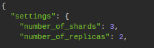

Tři shardy rozdělí index na tři nody. Nebude zátěž jen na jeden z nich. Dvě repliky umožní, že i jen s jedním nodem by měla být zachována plná funkcionalita a přístup k datům. 
  
### 3. 
Vytvorte mapping pre normalizované dáta z Postgresu - Tweet musí obsahovať údaje
rovnaké ako máte už uložené v PostgreSQL. Dbajte na to, aby ste vytvorili polia v správnom
dátovom type (polia ktoré má zmysel analyzovať analyzujte správne, tie ktoré nemá, aby
neboli zbytočne analyzované (keyword analyzer)) tak aby index nebol zbytočne veľký.
Mapovanie musí byť striktné.

**Viz [mapping.json](https://github.com/FIIT-DBS/zadanie-pdt-Kathelas007/blob/main/part5/elastic/mapping.json)**
  
### 4. 
Pre index tweets vytvorte 3 vlastné analyzéry (v settings) nasledovne:

#### 1. Analyzér "englando".
 Tento analyzér bude obsahovať nasledovné:
1.2. fitre: english_possessive_stemmer, lowercase, english_stop, english_stemmer,
1.3. char_filter: html_strip
1.4. tokenizer: štandardný
- ukážku nájdete na stránke elastic.co pre anglický analyzér

#### 2. Analyzér custom_ngram:
2.2. Filtre: lowercase, asciifolding, filter_ngrams (definujte si ho sami na rozmedzie 1-
10)
2.3. char_filter: html_strip
2.4. tokenizer: štandardný

#### 3. Analyzér custom_shingles:
3.2. Filtre: lowercase, asciifolding, filter_shingles (definujte si ho sami a dajte
token_separator: “”)
3.3. char_filter: html_strip
3.4. tokenizer: štandardný

**Viz [analyser.json](https://github.com/FIIT-DBS/zadanie-pdt-Kathelas007/blob/main/part5/elastic/analyser.json)**

Do mapovania pridajte:

1. každý anglický text (rátajme že každý tweet a description u autora je primárne
v angličtine) nech je analyzovaný novým analyzérom "englando"
2. Priraďte analýzery
a. author.name nech má aj mapovania pre custom_ngram, a custom_shingles,
b. author. screen_name nech má aj custom_ngram,
c. author.description nech má aj custom_shingles. Toto platí aj pre mentions, ak
tam tie záznamy máte.
3. Hashtagy indexujte ako lowercase

**Viz [mapping.json](https://github.com/FIIT-DBS/zadanie-pdt-Kathelas007/blob/main/part5/elastic/mapping.json)**
  
### 5. 
Vytvorte bulk import pre vaše normalizované Tweety.

**Viz skript [migrate.sh](https://github.com/FIIT-DBS/zadanie-pdt-Kathelas007/blob/main/part5/migration/migrate.sh)**
  
### 6. 
Importujete dáta do Elasticsearchu prvych 5000 tweetov

**./[migrate.sh](https://github.com/FIIT-DBS/zadanie-pdt-Kathelas007/blob/main/part5/migration/migrate.sh) -s 5000 -b 5000**
  
### 7. 
**A**
Experimentujte s nódami, a zistite koľko nódov musí bežať (a ktoré) aby vám Elasticsearch
vedel pridávať dokumenty, mazať dokumenty, prezerať dokumenty a vyhľadávať nad nimi?

Může běžet jen jeden, pokud si nastavím 2 repliky. Tím pádem budou data na všech nodech. 

**B**
Dá sa nastaviť Elastic tak, aby mu stačil jeden nód?

První node lze ještě ostranit normální cestou. Před odebráním dalšího  je ale potřeba dopředu vyčlenit jeden node z hlasování. Hlasovat může každý node, kterému není odepřeno se stát masterem. Hlasuje se například o výběru nového mastera, nebo stavu clusteru.

Vyčleněním jednoho nodu z hlasování přecházejí jeho práva na další. Vyčleněný node se pak může bezpečně smazat.  

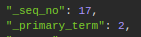  

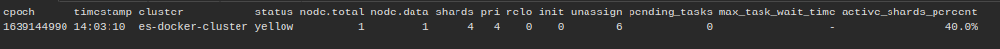  

### 8. 
Upravujte počet retweetov pre vami vybraný tweet pomocou vašeho jednoduchého
scriptu (v rámci Elasticsearchu) a sledujte ako sa mení _seq_no a _primary_term pri tom
ako zabíjate a spúšťate nódy.

Výchozí stav:  
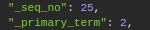  

Update se všemi nody:  
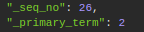  

Druhý update se všemi nody:  
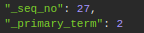  

Změna po vypnutí node03, jako primary byl označen jiný shard  
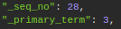  

Po nastartování node es03 se nemění ani jedno z čísel. Zůstává nejnovější verze.
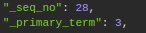

Změna při vypnutém node es02, kde byli informace primárně uložené, opět ovlivní obě čísla  
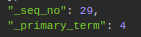  

Pokud zkusíme es02 znovu nastartovat a opět provedeme změnu při vypnutém es02, změní se jen seq number, jelikož primární shard není na es02.  

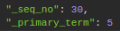  

### 9. 
Zrušte repliky a importujete všetky tweety

**./[migrate.sh](https://github.com/FIIT-DBS/zadanie-pdt-Kathelas007/blob/main/part5/migration/migrate.sh) -b 55000**

### 10. 
Vyhľadajte vo vašich tweetoch spojenie "gates s0ros vaccine micr0chip". V query použite
function_score, kde jednotlivé medzikroky sú nasledovné:
Query:
1. Must - vyhľadajte vo viacerých poliach (konkrétne: author.name (pomocou shingle),
content (cez analyzovaný anglický text), author.description (pomocou shingles),
author.screen_name (pomocou ngram)) spojenie "gates s0ros vaccine micr0chip",
zapojte podporu pre preklepy, operátor je OR.
2.1 tieto polia vo vyhľadávaní boost-nite nasledovne - author.name * 6, content * 8,
author.description * 6, author.screen_name * 10.
3. Filter - vyfiltrujte len tie, ktoré majú author.statuses_count > 1000 a tie, ktoré majú
hashtag „qanon“
4. Should – boost-nite 10 krat tie, ktoré obsahujú v mentions.name (tento objekt je typu
nested) cez ngram string "real".
5. Nastavte podmienené váhy cez functions nasledovne:
5.1. retweet_count, ktorý je väčší rovný ako 100 a menší rovný ako 500 na 6,
5.2. author.followers_count väčší ako 100 na 3
Zobrazte agregácie pre výsledky na konci. Vytvorte bucket hashtags podľa hashtagov
a spočítajte hodnoty výskytov (na webe by to mohli byť facety).

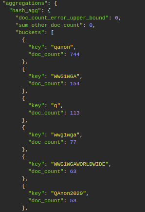

**Viz [query.json](https://github.com/FIIT-DBS/zadanie-pdt-Kathelas007/blob/main/part5/elastic/query.json)**

### 11. 
Konšpiračné teórie podľa Elasticu. Pracujte zo všetkými tweetami, ktoré máte. Následne
pre všetky týždne zistite pomocou vnorených agregácii, koľko retweet_count sumárne majú
tweety ktoré majú hashtagy z prvého zadania. Teda na základe hashtagov znova rozdeľte
tweety do konšpiračných teórii ale pomocou agregácii.

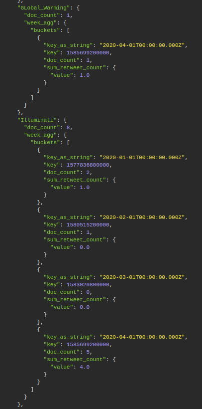

**Viz [query.json](https://github.com/FIIT-DBS/zadanie-pdt-Kathelas007/blob/main/part5/elastic/conspiracy_theories.json)**