# PDT - part 5


* repo link: [github](https://github.com/FIIT-DBS/zadanie-pdt-Kathelas007)  
* autor: Kateřina Mušková  

### 1.  
Import dat
```bash
sudo -u neo4j neo4j-admin load --from /home/awesome/STU/PDT/tweets2021.dump \
--database=neo4j --force
```
### 2.  
Vypíšte 5 Accountov s najvyšším množstvom followerov. Nezoraďujte Accounty podľa poľa
followers_count. Zaujímajú nás followujúce Accounty v našom datasete cez vzťah FOLLOWS.

```
MATCH (n:Account)<-[f:FOLLOWS]-(fa:Account) 
RETURN n, COUNT(f) ORDER BY COUNT(f) DESC LIMIT 5
```
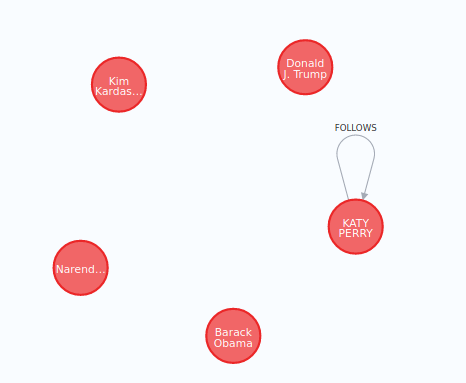

### 3.
Nájdite najkratšie cesty medzi Katy Perry {screen_name: ‘katyperry‘} a Kim Kardashian
{screen_name: ‘KimKardashian‘} cez vzťah FOLLOWS. Všetky cesty, kde Kim Kardashian
followuje niekoho, kto followuje niekoho, kto..., kto followuje Katy Perry.

```
MATCH path=allShortestPaths(
    (p:Account {screen_name:"katyperry"})
    <-[:FOLLOWS*1..100]-
    (k:Account {screen_name:'KimKardashian'}))
return path, length(path)
```

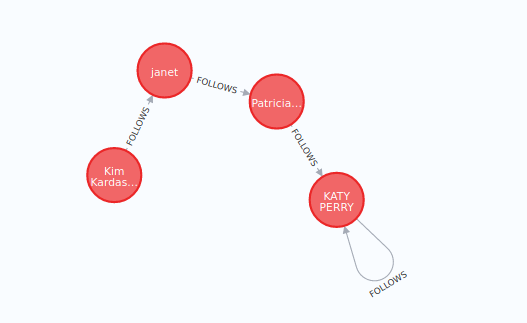

### 4.
Vyhľadajte neúspešné tweety influencerov. Vyhľadajte 10 najmenej retweetovanych tweetov
od Accountov, ktoré sú na prvých 10 miestach v celkovom počte retweetov.

```
MATCH (a:Account)-[p:POSTS]->(t:Tweet)
with a, p, count(p) as count_p
order by count(p) desc
limit 10

MATCH (a)-[:POSTS]->(loosertweet)<-[r:RETWEETS]-(:Tweet)
return a.screen_name,loosertweet.content, count(r)
order by count(r)
limit 10
```

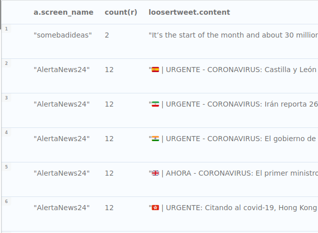

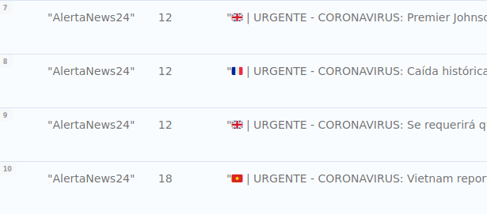

### 5.
Vytvorte volaním iba jednej query nový Account s Vašim menom, ktorý bude followovať
Donalda Trumpa {screen_name:"realDonaldTrump"} a v tom istom volaní vytvorte tweet,
ktorý bude retweetom Donaldovho najretweetovanejšieho tweetu.

```
MATCH (dt:Account {screen_name:"realDonaldTrump"})-[:POSTS]->
	(dtTweet:Tweet)<-[r:RETWEETS]-(:Tweet)
with dt, dtTweet, COUNT(r) as retweetCount order by COUNT(r) DESC limit 1

CREATE (myA:Account {screen_name: "Katka", name:"Katka"})-[:POSTS]->
	(ownT:Tweet {content: "Some briliant_tweet"})-[:RETWEETS]->(dtTweet)

with myA
MATCH cr = (myA)-[:POSTS]->(:Tweet)-[:RETWEETS]->(:Tweet)
	<-[:POSTS]-(:Account)
RETURN cr
```
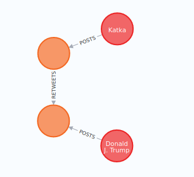

### 6.
Odporučte používateľovi {screen_name:"777stl"} followovanie ďalších Accountov, na základe
followovania rovnakých Accountov: Vyhľadajte 10 Accountov, ktoré followujú najviac
rovnakých Accountov ako náš používateľ, ale náš používateľ ich ešte nefollowuje.

```
MATCH (stl:Account {screen_name:"777stl"} )-[:FOLLOWS]->(oldFollow:Account)

WITH oldFollow, stl
MATCH (silimarA:Account)-[f:FOLLOWS]->(oldFollow)

WITH silimarA, count(f) as score , collect(DISTINCT oldFollow) as oldFollow, stl
WHERE not silimarA in oldFollow AND stl <> silimarA

return silimarA.screen_name, score order by score DESC  limit 10
```
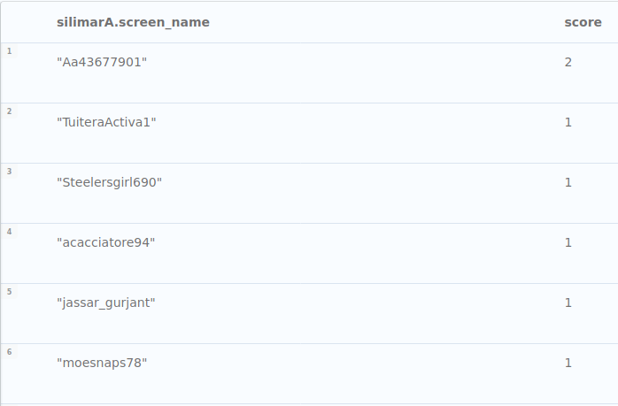 

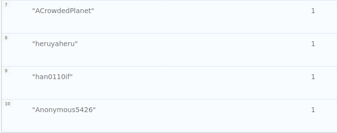

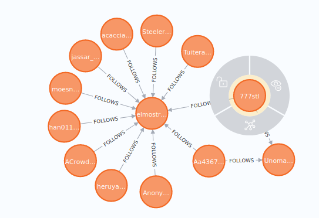

### 7.
Odporučte používateľovi {screen_name:"DaynerWilson"} followovanie ďalších Accountov na
základe zhody v retweetovaní rovnakých tweetov: Vyhľadajte 10 accountov, ktoré retweetli
najviac tých istých tweetov, ako náš používateľ. Ak tweet ktorý retweetujeme, je už tiež
retweetom, rátajte za zhodu aj retweetovanie jeho parent tweetu – retweetovanie teda
zohľadňujte rekurzívne.

```
MATCH (dw:Account {screen_name:"DaynerWilson"})-[:POSTS]->(dwt:Tweet)-
	[:RETWEETS*1..2]->(common:Tweet)
with common, dw, dwt

MATCH (similarA:Account)-[p:POSTS]->(t:Tweet)-[rt:RETWEETS]->(common:Tweet)
WHERE dw <> similarA
return similarA.screen_name, count(rt) as score order by score DESC limit 10
```
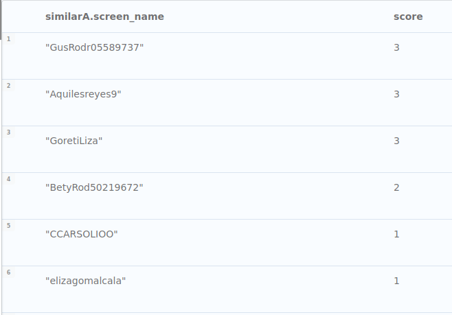 


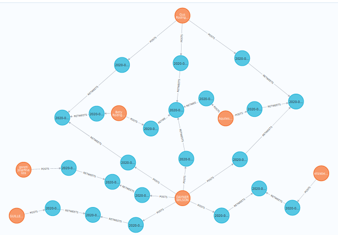

### 8.
Vyhľadajte 5 tweetov ostatných Accountov, ktoré do hĺbky 5 followujú account, ktorý napísal
tweet {id: "1289380305728503808"}, ktoré síce nie sú retweetom vybraného tweetu, ale
napriek tomu majú čo najviac rovnakých slov v poli content zhodných s vybraným tweetom
(stačí rozdeliť content na slová cez split(tweet.content, " "). Account, ktorý followuje
Account, ktorý followuje nami vybraný Account rozumieme hĺbkou 2. Odporúčam pozrieť si
procedúry v knižnici APOC pracujúce s collections, ale nie je to podmienkou na zvládnutie
úlohy.


```
MATCH (similarT:Tweet)<-[po:POSTS]-(otherA:Account)-[:FOLLOWS*5]->
	(mainA:Account)-[pm:POSTS]->(mainT:Tweet {id: "1289380305728503808"})
WHERE not exists((similarT)-[:RETWEETS]-(mainT))

RETURN similarT, size(apoc.coll.intersection(
    split(similarT.content, " "),
    split(mainT.content, " ")
    )) as score
ORDER by score
    DESC limit 5
```

**original tweet**  
"@JadeRhinos @eturleye @dougducey @SenMcSallyAZ Every decision they have made regarding COVID has been economically driven, which has allowed the virus to ravage our communities, and yet, when it came down to actually helping our economy, they adandonded our state’s unemployed"

**similar tweets**  
  
| content | score |
| --- | --- |
| ":@uaccn @SafeReturnUA @UofAlabama This law only applies to people actually infected by COVID, and not to the audience of your heinous email, which referenced “alternative arrangements” for day care and the like. So no. That wasn’t your intent, or your email would have explicitly said “if you get sick, etc." | 6 |
| "RT @natasharoyy: my mom’s friend in India called to tell her that her husband insulted the dinner she made &amp; called it bland and tasteless,…" | 5 |
| "RT @natasharoyy: my mom’s friend in India called to tell her that her husband insulted the dinner she made &amp; called it bland and tasteless,…" | 5 |
| "RT @dougmar_: the United States is the only country that still have a corona virus problem and Trump wants to focus on tik tok?" | 5 |
| "RT @dougmar_: the United States is the only country that still have a corona virus problem and Trump wants to focus on tik tok?" | 5 |


**BONUS**  
Pomocné vztahy
```
MATCH (start:Account)-[:POSTS]->(:Tweet)-[:RETWEETS]->(:Tweet)
	<-[:POSTS]-(end:Account) 
CREATE (start)-[:ACCOUNTRETWEET]->(end)
```

Query  
```
MATCH  (kp:Account {screen_name:"katyperry"}),
	 (dt:Account {screen_name:"realDonaldTrump"}),
	p = shortestPath((kp)-[:ACCOUNTRETWEET*1..15]-(dt))
RETURN p
```
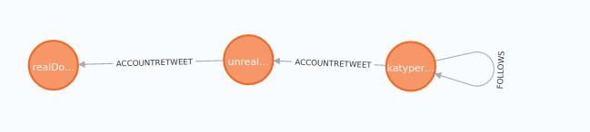